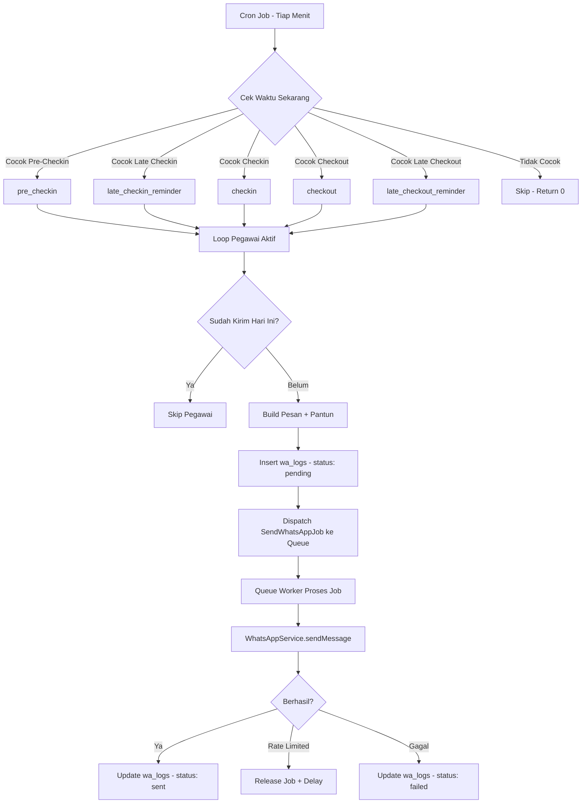

# 📋 Dokumentasi Website Pengingat Absen

> **Sistem Pengingat Absensi Otomatis via WhatsApp**
> Dibangun dengan Laravel 12 · PHP 8.2+ · SQLite · Tailwind CSS 4

---

## 📑 Daftar Isi

1. [Gambaran Umum](#-gambaran-umum)
2. [Teknologi yang Digunakan](#-teknologi-yang-digunakan)
3. [Persyaratan Sistem](#-persyaratan-sistem)
4. [Instalasi & Setup](#-instalasi--setup)
5. [Konfigurasi Environment](#-konfigurasi-environment)
6. [Arsitektur Aplikasi](#-arsitektur-aplikasi)
7. [Struktur Database](#-struktur-database)
8. [Fitur-Fitur Utama](#-fitur-fitur-utama)
9. [Sistem Routing](#-sistem-routing)
10. [Template Pesan](#-template-pesan)
11. [Sistem Penjadwalan Otomatis](#-sistem-penjadwalan-otomatis)
12. [WhatsApp Bot (Webhook)](#-whatsapp-bot-webhook)
13. [Integrasi API WhatsApp](#-integrasi-api-whatsapp)
14. [Queue & Background Jobs](#-queue--background-jobs)
15. [Artisan Commands](#-artisan-commands)
16. [Import & Export Data Karyawan](#-import--export-data-karyawan)
17. [Keamanan](#-keamanan)
18. [Troubleshooting](#-troubleshooting)
19. [Deployment ke Production](#-deployment-ke-production)
20. [Lisensi](#-lisensi)

---

## 🎯 Gambaran Umum

**Pengingat Absen** adalah aplikasi web berbasis Laravel yang dirancang untuk mengirimkan pengingat absensi secara otomatis kepada pegawai melalui WhatsApp. Aplikasi ini dibangun untuk membantu instansi/organisasi (default: BPS Kabupaten Karanganyar) memastikan pegawai tidak lupa melakukan absensi masuk dan pulang.

### Cara Kerja Singkat

```
┌─────────────┐     ┌──────────────┐     ┌────────────────┐     ┌─────────────┐
│  Scheduler   │────▶│  Artisan Cmd │────▶│  Queue (Job)   │────▶│  WhatsApp   │
│  (Cron)      │     │  wa:send-    │     │  SendWhatsApp  │     │  API        │
│  Tiap Menit  │     │  reminders   │     │  Job           │     │  (Fonnte/   │
│              │     │              │     │                │     │   dll.)     │
└─────────────┘     └──────────────┘     └────────────────┘     └─────────────┘
       │                                                              │
       │                                                              ▼
       │                                                     ┌─────────────┐
       │                                                     │  Pegawai    │
       │                                                     │  menerima   │
       │                                                     │  WA         │
       └─────────────────────────────────────────────────────▶└─────────────┘
```

### Fitur Highlights

| Fitur | Deskripsi |
|-------|-----------|
| 🕐 **Pengingat Otomatis** | Jadwal pengingat masuk & pulang otomatis setiap hari kerja |
| 📱 **Multi-Provider WA** | Support Fonnte, WaSender, dan Infobip |
| 🤖 **WhatsApp Bot** | Kelola pegawai & kirim broadcast via perintah WA |
| 📥 **Import/Export** | Kelola data pegawai via file CSV/XLSX/XLS/ODS |
| 📝 **Template Custom** | Pesan bisa dikustomisasi dengan placeholder dinamis |
| 🎭 **Pantun Otomatis** | Pesan dilengkapi pantun motivasi yang acak |
| ⏰ **Multi-Jadwal** | Pengingat pra-masuk, masuk, terlambat, pulang, terlambat pulang |
| 📊 **Dashboard Admin** | Monitoring status pengiriman real-time |

---

## 🛠 Teknologi yang Digunakan

### Backend
| Komponen | Teknologi | Versi |
|----------|-----------|-------|
| Framework | Laravel | 12.x |
| Bahasa | PHP | ≥ 8.2 |
| Database | mysql | - |
| Queue | Database Queue | - |
| Scheduler | Laravel Task Scheduling | - |

### Frontend
| Komponen | Teknologi | Versi |
|----------|-----------|-------|
| CSS Framework | Tailwind CSS | 4.x |
| Template Engine | Blade | - |
| Build Tool | Vite | 7.x |
| HTTP Client | Axios | 1.x |

### Package Tambahan
| Package | Fungsi |
|---------|--------|
| `maatwebsite/excel` | Import/export data pegawai (CSV, XLSX, XLS, ODS) |
| `box/spout` | Engine spreadsheet untuk maatwebsite/excel |
| `laravel/tinker` | REPL interaktif untuk debugging |

---

## 💻 Persyaratan Sistem

- **PHP** ≥ 8.2 dengan ekstensi:
  - `pdo_sqlite`
  - `mbstring`
  - `openssl`
  - `fileinfo`
  - `json`
  - `curl`
- **Composer** ≥ 2.x
- **Node.js** ≥ 18.x dan **npm** ≥ 9.x
- **SQLite 3**
- **Akun WhatsApp API** (Fonnte / WaSender / Infobip)
- **Cron job** (untuk server production — menjalankan `php artisan schedule:run` tiap menit)

---

## 🚀 Instalasi & Setup

### Cara Cepat (1 Command)

```bash
composer setup
```

Script `composer setup` akan menjalankan:
1. `composer install` — Install dependensi PHP
2. Copy `.env.example` → `.env` (jika belum ada)
3. `php artisan key:generate` — Generate application key
4. `php artisan migrate --force` — Buat struktur database
5. `npm install` — Install dependensi Node.js
6. `npm run build` — Build asset frontend

### Cara Manual (Step-by-Step)

```bash
# 1. Clone repository
git clone <repository-url> pengingat-absen
cd pengingat-absen

# 2. Install dependensi PHP
composer install

# 3. Salin file environment
copy .env.example .env        # Windows
# cp .env.example .env        # Linux/Mac

# 4. Generate application key
php artisan key:generate

# 5. Buat file database SQLite (jika belum ada)
# File: database/database.sqlite
type nul > database/database.sqlite    # Windows
# touch database/database.sqlite       # Linux/Mac

# 6. Jalankan migrasi database
php artisan migrate

# 7. Install dependensi frontend
npm install

# 8. Build asset frontend
npm run build
```

### Menjalankan Development Server

```bash
composer dev
```

Perintah ini menjalankan **3 proses sekaligus** secara paralel:
1. **`php artisan serve`** — Server Laravel (http://localhost:8000)
2. **`php artisan queue:listen`** — Queue worker untuk background jobs
3. **`npm run dev`** — Vite dev server untuk hot-reload frontend

> 💡 Ketiga proses dikelola oleh `concurrently` sehingga cukup 1 terminal.

---

## ⚙ Konfigurasi Environment

File `.env` berisi konfigurasi utama aplikasi. Berikut variabel yang perlu diatur:

### Konfigurasi Umum

```env
APP_NAME="Pengingat Absen"
APP_ENV=local             # Ubah ke 'production' di server
APP_DEBUG=true            # Ubah ke 'false' di server
APP_URL=http://localhost
```

### Konfigurasi Database

```env
DB_CONNECTION=sqlite
# File database: database/database.sqlite
```

### Konfigurasi Queue

```env
QUEUE_CONNECTION=database
```

### Konfigurasi WhatsApp API

```env
# Fonnte (default)
WHATSAPP_API_URL=https://api.fonnte.com
WHATSAPP_API_KEY=your-api-key-here

# WaSender
# WHATSAPP_API_URL=https://app.wasender.id
# WHATSAPP_API_KEY=your-api-key-here

# Infobip
# WHATSAPP_API_URL=https://xxxxx.api.infobip.com
# WHATSAPP_API_KEY=your-api-key-here
# WHATSAPP_FROM=447860099299

# Nomor admin untuk menerima konfirmasi dari bot WA
ADMIN_WA_NUMBER=6281234567890
```

> ⚠️ **Penting:** Hanya aktifkan SATU provider WhatsApp dalam satu waktu.

---

## 🏗 Arsitektur Aplikasi

### Diagram Arsitektur

```
pengingat-absen/
│
├── app/
│   ├── Console/
│   │   ├── Commands/
│   │   │   ├── SendWaReminder.php    ← Artisan command kirim pengingat
│   │   │   └── TestWhatsApp.php      ← Command tes kirim WA
│   │   └── Kernel.php                ← Scheduler (cron tiap menit)
│   │
│   ├── Http/
│   │   └── Controllers/
│   │       ├── AdminController.php   ← Dashboard, CRUD, broadcast
│   │       ├── AuthController.php    ← Login & logout
│   │       └── WebhookController.php ← Bot WA (perintah via chat)
│   │
│   ├── Jobs/
│   │   └── SendWhatsAppJob.php       ← Background job kirim WA
│   │
│   ├── Models/
│   │   ├── Employee.php              ← Model pegawai
│   │   ├── Setting.php               ← Model pengaturan (key-value)
│   │   └── User.php                  ← Model admin/pengguna
│   │
│   ├── Providers/
│   └── Services/
│       └── WhatsAppService.php       ← Service kirim pesan WA
│
├── config/
│   └── whatsapp.php                  ← Konfigurasi provider WA
│
├── database/
│   ├── database.sqlite               ← File database
│   └── migrations/                   ← Schema database
│
├── resources/views/
│   ├── admin/
│   │   └── dashboard.blade.php       ← Halaman dashboard admin
│   ├── auth/
│   │   └── login.blade.php           ← Halaman login
│   └── layouts/                      ← Layout template
│
├── routes/
│   ├── web.php                       ← Definisi routing
│   └── console.php                   ← Route console
│
├── .env                              ← Konfigurasi environment
├── composer.json                     ← Dependensi PHP
└── package.json                      ← Dependensi Node.js
```

### Alur Kerja Aplikasi



---

## 🗄 Struktur Database

### Diagram Entity-Relationship

```
┌──────────────────────────┐      ┌──────────────────────────┐
│        employees         │      │         wa_logs          │
├──────────────────────────┤      ├──────────────────────────┤
│ id          (PK, BIGINT) │──1:N─│ id          (PK, BIGINT) │
│ name        (VARCHAR)    │      │ employee_id (FK, BIGINT) │
│ panggilan   (VARCHAR)    │      │ type        (VARCHAR)    │
│ phone_number(VARCHAR)    │      │ scheduled_at(TIMESTAMP)  │
│ is_active   (BOOLEAN)    │      │ status      (VARCHAR)    │
│ created_at  (TIMESTAMP)  │      │ sent_at     (TIMESTAMP)  │
│ updated_at  (TIMESTAMP)  │      │ created_at  (TIMESTAMP)  │
└──────────────────────────┘      │ updated_at  (TIMESTAMP)  │
                                  └──────────────────────────┘

┌──────────────────────────┐      ┌──────────────────────────┐
│        settings          │      │         pantuns          │
├──────────────────────────┤      ├──────────────────────────┤
│ id          (PK, BIGINT) │      │ id          (PK, BIGINT) │
│ key         (VARCHAR, UQ)│      │ type        (VARCHAR/20) │
│ value       (VARCHAR)    │      │ text        (TEXT)       │
│ created_at  (TIMESTAMP)  │      │ created_at  (TIMESTAMP)  │
│ updated_at  (TIMESTAMP)  │      │ updated_at  (TIMESTAMP)  │
└──────────────────────────┘      └──────────────────────────┘

┌──────────────────────────┐
│          users           │
├──────────────────────────┤
│ id          (PK, BIGINT) │
│ name        (VARCHAR)    │
│ email       (VARCHAR, UQ)│
│ password    (VARCHAR)    │
│ remember_token(VARCHAR)  │
│ email_verified_at(TSTAMP)│
│ created_at  (TIMESTAMP)  │
│ updated_at  (TIMESTAMP)  │
└──────────────────────────┘
```

### Penjelasan Tabel

#### 1. `employees` — Data Pegawai

| Kolom | Tipe | Deskripsi |
|-------|------|-----------|
| `id` | BIGINT (PK) | ID unik pegawai |
| `name` | VARCHAR | Nama lengkap pegawai |
| `panggilan` | VARCHAR | Sapaan/panggilan (default: `Yth.`) |
| `phone_number` | VARCHAR | Nomor telepon/WA (format: `812xxxxx` tanpa awalan `0`) |
| `is_active` | BOOLEAN | Status aktif (hanya pegawai aktif yang menerima pengingat) |
| `created_at` | TIMESTAMP | Waktu pembuatan data |
| `updated_at` | TIMESTAMP | Waktu update terakhir |

#### 2. `settings` — Pengaturan Aplikasi (Key-Value Store)

| Kolom | Tipe | Deskripsi |
|-------|------|-----------|
| `id` | BIGINT (PK) | ID unik |
| `key` | VARCHAR (UNIQUE) | Kunci pengaturan |
| `value` | VARCHAR (NULLABLE) | Nilai pengaturan |

**Daftar Key Setting yang Digunakan:**

| Key | Default Value | Deskripsi |
|-----|---------------|-----------|
| `check_in_time` | `07:30` | Jam absen masuk |
| `check_out_time` | `16:00` | Jam absen pulang (Senin-Kamis) |
| `check_out_time_friday` | `16:30` | Jam absen pulang (Jumat) |
| `pre_reminder_minutes` | `30` | Menit sebelum jam masuk untuk pengingat awal |
| `organization_name` | `BPS Karanganyar` | Nama organisasi |
| `closing_word` | `Hormat kami, {org}` | Kata penutup pesan |
| `template_checkin` | *(lihat Template)* | Template pesan absen masuk |
| `template_checkout` | *(lihat Template)* | Template pesan absen pulang |
| `template_pre_checkin` | *(lihat Template)* | Template pengingat sebelum masuk |
| `template_pre_checkout` | *(lihat Template)* | Template pengingat sebelum pulang |
| `template_broadcast` | *(lihat Template)* | Template pesan broadcast/umum |
| `template_checkin_formal` | *(lihat Template)* | Template formal absen masuk |
| `template_checkout_formal` | *(lihat Template)* | Template formal absen pulang |
| `template_pre_checkin_formal` | *(lihat Template)* | Template formal pra-masuk |
| `template_late_checkin_formal` | *(lihat Template)* | Template formal terlambat masuk |
| `template_late_checkout_formal` | *(lihat Template)* | Template formal terlambat pulang |

#### 3. `wa_logs` — Log Pengiriman WhatsApp

| Kolom | Tipe | Deskripsi |
|-------|------|-----------|
| `id` | BIGINT (PK) | ID unik log |
| `employee_id` | BIGINT (FK) | Referensi ke pegawai |
| `type` | VARCHAR | Jenis pengiriman (lihat tabel di bawah) |
| `scheduled_at` | TIMESTAMP | Waktu dijadwalkan |
| `status` | VARCHAR | Status pengiriman |
| `sent_at` | TIMESTAMP | Waktu terkirim (null jika belum terkirim) |

**Nilai `type`:**

| Type | Deskripsi |
|------|-----------|
| `pre_checkin` | Pengingat sebelum jam masuk |
| `late_checkin_reminder` | Pengingat terlambat masuk (15 menit sebelum jam masuk) |
| `checkin` | Pengingat tepat jam masuk |
| `checkout` | Pengingat tepat jam pulang |
| `late_checkout_reminder` | Pengingat terlambat pulang (15 menit setelah jam pulang) |
| `manual` | Dikirim manual (broadcast dari dashboard) |
| `webhook_checkmasuk` | Dikirim via perintah bot WA (masuk) |
| `webhook_checkpulang` | Dikirim via perintah bot WA (pulang) |

**Nilai `status`:**

| Status | Deskripsi |
|--------|-----------|
| `pending` | Menunggu dikirim / dalam antrean |
| `sent` | Berhasil terkirim |
| `failed` | Gagal dikirim |
| `rate_limited` | Ditolak karena rate limit API |

#### 4. `pantuns` — Koleksi Pantun Motivasi

| Kolom | Tipe | Deskripsi |
|-------|------|-----------|
| `id` | BIGINT (PK) | ID unik |
| `type` | VARCHAR(20) | Jenis pantun: `masuk` atau `pulang` |
| `text` | TEXT | Isi pantun |

---

## ✨ Fitur-Fitur Utama

### 1. 🔐 Autentikasi Admin

- **Login** menggunakan email & password
- Session-based authentication (Laravel Auth)
- Redirect otomatis ke dashboard setelah login
- Session regeneration untuk keamanan
- Semua halaman admin dilindungi middleware `auth`

### 2. 📊 Dashboard Admin

Dashboard menampilkan:
- **Statistik** — Jumlah pegawai aktif dan total pesan terkirim hari ini
- **Daftar Pegawai** — Tabel pegawai dengan status pengiriman (Terkirim ✅ / Menunggu ⏳ / Gagal ❌)
- **Pengaturan Waktu** — Form atur jam masuk, pulang, dan pulang Jumat
- **Pengaturan Template** — Edit template pesan untuk semua jenis pengingat
- **Kirim Manual** — Tombol untuk broadcast pengingat secara langsung
- **Import/Export** — Upload file pegawai atau download data pegawai

### 3. 👥 Manajemen Pegawai (CRUD)

| Aksi | Endpoint | Method |
|------|----------|--------|
| Tambah pegawai | `POST /admin/employees` | Form di dashboard |
| Edit pegawai | `PUT /admin/employees/{id}` | Modal edit |
| Hapus pegawai | `DELETE /admin/employees/{id}` | Tombol hapus |
| Import dari file | `POST /admin/employees/import` | Upload CSV/XLSX |
| Export ke CSV | `GET /admin/employees/export` | Tombol download |

**Data yang dikelola per pegawai:**
- Nama lengkap
- Panggilan/sapaan (contoh: `Bapak`, `Ibu`, `Sdr.`, `Yth.`)
- Nomor telepon/WA
- Status aktif/nonaktif

### 4. ⏰ Pengingat Otomatis 5-Tahap

Sistem mengirim pengingat di **5 titik waktu** setiap hari kerja:

```
─────────────────────────── Timeline Hari Kerja ───────────────────────────

 07:00        07:15        07:30                      16:00        16:15
   │            │            │                          │            │
   ▼            ▼            ▼                          ▼            ▼
 ┌────┐      ┌────┐      ┌────┐                     ┌────┐      ┌────┐
 │PRE │      │LATE│      │ IN │                     │OUT │      │LATE│
 │ IN │      │ IN │      │    │                     │    │      │OUT │
 └────┘      └────┘      └────┘                     └────┘      └────┘
  -30m        -15m        Masuk                     Pulang       +15m
```

| # | Waktu | Tipe | Deskripsi |
|---|-------|------|-----------|
| 1 | `check_in - 30 menit` | `pre_checkin` | Pengingat awal: "30 menit lagi jam masuk" |
| 2 | `check_in - 15 menit` | `late_checkin_reminder` | Pengingat mendesak: "15 menit lagi!" |
| 3 | `check_in` (tepat) | `checkin` | Pengingat tepat waktu: "Sudah waktunya absen masuk" |
| 4 | `check_out` (tepat) | `checkout` | Pengingat pulang: "Sudah waktunya absen pulang" |
| 5 | `check_out + 15 menit` | `late_checkout_reminder` | Pengingat terlambat pulang |

> 💡 **Khusus Jumat:** Jam pulang menggunakan setting `check_out_time_friday` (default: 16:30).

### 5. 📤 Kirim Manual (Broadcast)

Tiga jenis broadcast yang bisa dikirim manual dari dashboard:

| Tombol | Fungsi | Endpoint |
|--------|--------|----------|
| **Broadcast Cepat** | Kirim pesan custom ke semua pegawai aktif | `POST /admin/send-now` |
| **Pengingat Masuk** | Kirim pengingat pra-checkin sekarang | `POST /admin/send-pre-checkin` |
| **Pengingat Pulang** | Kirim pengingat pra-checkout sekarang | `POST /admin/send-pre-checkout` |

> 📝 Broadcast manual menggunakan `dispatchSync` (sinkronus) agar hasilnya langsung terlihat di dashboard.

### 6. 🎭 Pantun Motivasi Otomatis

Setiap pesan pengingat secara otomatis dilengkapi pantun motivasi acak. Terdapat dua sumber pantun:

**a. Dari Database (`pantuns` table):**
- Tipe `masuk` — digunakan untuk pengingat checkin
- Tipe `pulang` — digunakan untuk pengingat checkout

**b. Dari Hardcode (Fallback):**
Jika tabel pantuns kosong, sistem menggunakan pantun bawaan, contoh:
- *"Bekerja dengan sungguh-sungguh, Akan membawa hasil yang maksimal."*
- *"Tepat waktu adalah prioritas, Menjaga kepercayaan organisasi."*
- *"Kehadiran penuh setiap hari, Bentuk komitmen terhadap tugas."*

---

## 🔀 Sistem Routing

### Routing Publik

| Method | URI | Deskripsi |
|--------|-----|-----------|
| `GET` | `/` | Redirect ke halaman login |
| `POST` | `/webhook/fonnte` | Endpoint webhook untuk bot WA |
| `GET` | `/login` | Halaman login |
| `POST` | `/login` | Proses login |
| `POST` | `/logout` | Proses logout |

### Routing Admin (Dilindungi Middleware `auth`)

| Method | URI | Nama Route | Deskripsi |
|--------|-----|------------|-----------|
| `GET` | `/admin` | `admin.dashboard` | Dashboard utama |
| `POST` | `/admin/settings` | `admin.settings.update` | Update pengaturan |
| `POST` | `/admin/set-default-times` | `admin.set-default-times` | Reset ke waktu default |
| `POST` | `/admin/employees` | `admin.employees.store` | Tambah pegawai |
| `PUT` | `/admin/employees/{id}` | `admin.employees.update` | Edit pegawai |
| `DELETE` | `/admin/employees/{id}` | `admin.employees.delete` | Hapus pegawai |
| `GET` | `/admin/employees/export` | `admin.employees.export` | Export CSV |
| `POST` | `/admin/employees/import` | `admin.employees.import` | Import file |
| `POST` | `/admin/send-now` | `admin.send-now` | Broadcast cepat |
| `POST` | `/admin/send-pre-checkin` | `admin.send-pre-checkin` | Kirim pengingat masuk |
| `POST` | `/admin/send-pre-checkout` | `admin.send-pre-checkout` | Kirim pengingat pulang |

> 🛡 Routing `GET` untuk `/send-now`, `/send-pre-checkin`, `/send-pre-checkout` di-redirect kembali ke dashboard dengan pesan error untuk mencegah akses langsung via URL.

---

## 📝 Template Pesan

### Placeholder yang Tersedia

| Placeholder | Deskripsi | Contoh Output |
|-------------|-----------|---------------|
| `{name}` | Panggilan + Nama pegawai | `Bapak Ahmad Fauzi` |
| `{kata}` | Kata penutup (dari setting) | `Hormat kami, BPS Karanganyar` |
| `{pantun}` | Pantun acak otomatis | *(pantun motivasi)* |
| `{organization_name}` | Nama organisasi | `BPS Karanganyar` |
| `{organization}` | Nama organisasi (alias) | `BPS Kabupaten Karanganyar` |
| `{target_time}` | Jam target absen | `07:30` |
| `{minutes_left}` | Sisa menit ke jam target | `25` |

### Contoh Template Default

#### Template Pre-Checkin (Formal)
```
Dengan hormat,

{name},

Kami dari {organization_name} ingin mengingatkan bahwa dalam 30 menit
lagi adalah waktu untuk absensi pagi. Mohon untuk segera melakukan
absensi tepat waktu.

{pantun}

{kata}
```

#### Template Checkin (Formal)
```
Dengan hormat,

{name},

Sudah saatnya waktu absensi pagi tiba. Kami dari {organization_name}
mengingatkan agar segera melakukan absensi. Terima kasih atas
perhatian dan kepatuhan Anda.

{pantun}

{kata}
```

#### Template Checkout (Formal)
```
Dengan hormat,

{name},

Sudah saatnya waktu absensi pulang. Kami dari {organization_name}
mengingatkan agar segera melakukan absensi pulang. Terima kasih atas
dedikasi kerja keras Anda hari ini.

{pantun}

{kata}
```

#### Template Broadcast Manual
```
Halo {name},

Pengumuman: mohon perhatian untuk seluruh pegawai.

{kata}
```

---

## 🕐 Sistem Penjadwalan Otomatis

### Konfigurasi Scheduler

Scheduler didefinisikan di `app/Console/Kernel.php`:

```php
protected function schedule(Schedule $schedule): void
{
    $schedule->command('wa:send-reminders')->everyMinute();
}
```

**Cara kerja:**
1. Cron job menjalankan `php artisan schedule:run` **setiap menit**
2. Command `wa:send-reminders` dipanggil
3. Command membandingkan waktu saat ini (`H:i`) dengan 5 titik waktu
4. Jika cocok, loop semua pegawai aktif
5. Cek duplikasi (cegah kirim 2x di hari yang sama untuk tipe sama)
6. Build pesan dengan template + pantun
7. Dispatch ke queue

### Setup Cron Job (Production)

Tambahkan baris berikut ke crontab server:

```bash
# Linux / Mac
* * * * * cd /path-to-project && php artisan schedule:run >> /dev/null 2>&1
```

```powershell
# Windows (Task Scheduler)
# Buat scheduled task yang menjalankan:
php C:\path-to-project\artisan schedule:run
# Interval: Setiap 1 menit
```

---

## 🤖 WhatsApp Bot (Webhook)

### Cara Mengaktifkan

1. Daftarkan URL webhook di provider WhatsApp API Anda:
   ```
   https://your-domain.com/webhook/fonnte
   ```
2. Set `ADMIN_WA_NUMBER` di `.env` dengan nomor admin
3. Hanya pesan dari nomor admin yang akan diproses

### Perintah Bot yang Tersedia

| Perintah | Contoh | Fungsi |
|----------|--------|--------|
| **masuk** | `masuk` | Broadcast pengingat absen masuk ke semua pegawai aktif |
| **pulang** | `pulang` | Broadcast pengingat absen pulang ke semua pegawai aktif |
| **tambah** | `tambah Budi Santoso 081234567890` | Daftarkan pegawai baru |
| **tambah (bulk)** | *(lihat di bawah)* | Daftarkan banyak pegawai sekaligus |
| *(lainnya)* | `help` / `halo` / dll | Tampilkan menu panduan |

### Contoh Tambah Pegawai Bulk via WhatsApp

```
tambah
1. Ahmad Fauzi 081234567890
2. Siti Nurhaliza 082345678901
3. Budi Santoso 083456789012
```

### Alur Webhook

```
WhatsApp API ──POST──▶ /webhook/fonnte
                            │
                            ▼
                    Cek Nomor Pengirim
                    == ADMIN_WA_NUMBER?
                            │
                    ┌───────┴───────┐
                    │ Ya            │ Tidak
                    ▼               ▼
              Parse Perintah    Return 'ignored'
                    │
          ┌─────────┼─────────┐
          ▼         ▼         ▼
       "masuk"   "pulang"  "tambah ..."
          │         │         │
          ▼         ▼         ▼
      Broadcast  Broadcast  Parse nama
      checkin    checkout   & nomor HP
          │         │         │
          └─────────┼─────────┘
                    ▼
            Kirim Konfirmasi
            ke Admin via WA
```

---

## 📡 Integrasi API WhatsApp

### Multi-Provider Support

`WhatsAppService` mendukung 3 provider secara otomatis berdasarkan URL:

| Provider | Deteksi | Endpoint | Auth Header |
|----------|---------|----------|-------------|
| **Fonnte** | Default (tidak cocok pattern lain) | `{url}/send` | `Authorization: {token}` |
| **WaSender** | URL mengandung `wasender` | `{url}/api/send-message` | `Authorization: Bearer {token}` |
| **Infobip** | URL mengandung `infobip` | `{url}/whatsapp/1/message/text` | `Authorization: App {token}` |

### Normalisasi Nomor Telepon

Sistem secara otomatis menormalisasi nomor telepon:
- Menghapus karakter non-angka (kecuali `+`)
- Menghapus awalan `0` (contoh: `0812...` → `812...`)
- Infobip menambahkan prefix `62` secara otomatis

### Penanganan Error

| Kode HTTP | Handling |
|-----------|----------|
| `200` + API success | ✅ Tandai `sent` |
| `200` + API error | ❌ Tandai `failed` (API menolak) |
| `401` | ❌ Auth error — API key salah |
| `429` | ⏰ Rate limited — job di-release dengan delay |
| Exception | ❌ Tandai `failed` + log error |

### SSL Verification

Di mode `local` atau `debug=true`, SSL verification dinonaktifkan secara otomatis untuk mempermudah development.

---

## ⚡ Queue & Background Jobs

### Konfigurasi

```env
QUEUE_CONNECTION=database
```

Queue menggunakan tabel database Laravel (`jobs`, `failed_jobs`, `job_batches`) yang dibuat saat migrasi.

### SendWhatsAppJob

Job yang bertanggung jawab mengirim pesan WhatsApp secara asinkron.

**Constructor Parameters:**

| Parameter | Tipe | Deskripsi |
|-----------|------|-----------|
| `$logId` | `int` | ID dari `wa_logs` |
| `$employeeId` | `int` | ID pegawai |
| `$phone` | `string` | Nomor telepon |
| `$message` | `string` | Isi pesan |
| `$type` | `string` | Tipe pengiriman (default: `manual`) |

**Alur Job:**

```
Dispatch ──▶ Queue Worker ──▶ handle()
                                │
                    ┌───────────┼───────────┐
                    ▼           ▼           ▼
                 Sukses     Rate Limit    Gagal
                    │           │           │
                    ▼           ▼           ▼
              wa_logs:       Release      wa_logs:
              sent          + delay       failed
```

### Menjalankan Queue Worker

```bash
# Development (otomatis via composer dev)
php artisan queue:listen --tries=1 --timeout=0

# Production (gunakan Supervisor)
php artisan queue:work --sleep=3 --tries=3 --max-time=3600
```

---

## 🔧 Artisan Commands

### `wa:send-reminders`

Kirim pengingat absen sesuai jadwal. Dijalankan otomatis oleh scheduler setiap menit.

```bash
php artisan wa:send-reminders
```

**Perilaku:**
- Cek waktu sekarang vs 5 titik waktu pengingat
- Jika cocok, kirim ke semua pegawai aktif yang belum mendapat pengingat tipe tersebut hari ini
- Pesan dibangun dari template formal + pantun acak

### `wa:test {phone} {message?}`

Kirim pesan tes ke satu nomor untuk memverifikasi konfigurasi API WhatsApp.

```bash
# Dengan pesan default
php artisan wa:test 081234567890

# Dengan pesan custom
php artisan wa:test 081234567890 "Halo, ini pesan tes!"
```

**Output:**
```
Testing WhatsApp to: 081234567890
Message: Halo, ini pesan tes!

=== RESULT ===
{
    "success": true,
    "status": 200
}
✅ Message sent successfully!
```

---

## 📥 Import & Export Data Karyawan

### Import

**Format file yang didukung:** CSV, XLSX, XLS, ODS (maks 5 MB)

**Struktur file import:**

| Kolom A | Kolom B | Kolom C (Opsional) |
|---------|---------|---------------------|
| Nama | Nomor HP | Panggilan |
| Ahmad Fauzi | 081234567890 | Bapak |
| Siti Nurhaliza | 082345678901 | Ibu |

**Aturan Import:**
- Header baris pertama otomatis terdeteksi dan dilewati
- Kolom panggilan bersifat opsional (default: `Yth.`)
- Nomor telepon otomatis dinormalisasi
- Baris kosong atau tanpa nama/nomor akan dilewati
- Pegawai langsung aktif setelah diimport

### Export

Export menghasilkan file **CSV** (UTF-8 BOM) yang kompatibel dengan Excel.

**Format output:**

| No | Nama Pegawai | Nomor Telepon / WA | Panggilan |
|----|-------------|--------------------|-----------| 
| 1 | Ahmad Fauzi | 0812345678 | Bapak |
| 2 | Siti Nurhaliza | 0823456789 | Ibu |

**Nama file:** `employees-YYYYMMDD-HHmmss.csv`

---

## 🔒 Keamanan

### Autentikasi
- Login berbasis session dengan bcrypt hashing (12 rounds)
- Session regeneration setelah login
- Session invalidation saat logout
- CSRF token di semua form POST

### Webhook
- Validasi nomor pengirim — hanya `ADMIN_WA_NUMBER` yang diproses
- Normalisasi nomor (hapus format +62, 0, karakter non-angka)
- Logging semua request masuk

### API Key
- API key WhatsApp disimpan di `.env` (tidak ter-commit ke Git)
- Token hanya di-log 10 karakter pertama + `***`
- SSL verification diaktifkan di production

### Validasi Input
- Semua input form divalidasi oleh Laravel Validation
- Validasi tipe file import (hanya CSV/XLSX/XLS/ODS)
- Ukuran file dibatasi 5 MB
- Nomor telepon dinormalisasi dari karakter berbahaya

---

## 🐛 Troubleshooting

### Pesan Tidak Terkirim

| Masalah | Penyebab | Solusi |
|---------|----------|-------|
| Missing WhatsApp config | `WHATSAPP_API_URL` atau `WHATSAPP_API_KEY` kosong | Isi konfigurasi di `.env` |
| Auth error (401) | API key salah | Periksa `WHATSAPP_API_KEY` |
| Rate limited (429) | Terlalu banyak request | Tunggu `retry_after` detik |
| SSL error | Certificate tidak valid | Set `APP_DEBUG=true` (dev only) |

### Queue Tidak Jalan

```bash
# Cek apakah ada job dalam antrean
php artisan tinker
> DB::table('jobs')->count()

# Jalankan queue worker manual
php artisan queue:listen --tries=1

# Lihat failed jobs
php artisan queue:failed
```

### Scheduler Tidak Berjalan

```bash
# Tes manual
php artisan wa:send-reminders

# Cek schedule list
php artisan schedule:list

# Jalankan schedule sekali (tes)
php artisan schedule:run
```

### Database Error

```bash
# Cek apakah file database ada
ls database/database.sqlite   # Linux
dir database\database.sqlite  # Windows

# Reset database (HATI-HATI: semua data hilang!)
php artisan migrate:fresh
```

### Cek Log Error

```bash
# Lihat log terbaru
# File: storage/logs/laravel.log

# Windows
type storage\logs\laravel.log

# Linux
tail -f storage/logs/laravel.log
```

---

## 🌐 Deployment ke Production

### Langkah-Langkah

```bash
# 1. Set environment production
APP_ENV=production
APP_DEBUG=false
APP_URL=https://your-domain.com

# 2. Install dependensi (production only)
composer install --optimize-autoloader --no-dev

# 3. Build frontend
npm run build

# 4. Cache konfigurasi
php artisan config:cache
php artisan route:cache
php artisan view:cache

# 5. Jalankan migrasi
php artisan migrate --force

# 6. Setup cron job
# Tambahkan ke crontab:
* * * * * cd /path-to-project && php artisan schedule:run >> /dev/null 2>&1

# 7. Jalankan queue worker (gunakan Supervisor)
php artisan queue:work --sleep=3 --tries=3 --max-time=3600
```

### Konfigurasi Supervisor (Linux)

Buat file `/etc/supervisor/conf.d/pengingat-absen-worker.conf`:

```ini
[program:pengingat-absen-worker]
process_name=%(program_name)s_%(process_num)02d
command=php /path-to-project/artisan queue:work --sleep=3 --tries=3 --max-time=3600
autostart=true
autorestart=true
stopasgroup=true
killasgroup=true
user=www-data
numprocs=1
redirect_stderr=true
stdout_logfile=/path-to-project/storage/logs/worker.log
stopwaitsecs=3600
```

```bash
sudo supervisorctl reread
sudo supervisorctl update
sudo supervisorctl start pengingat-absen-worker:*
```

### Checklist Production

- [ ] Set `APP_ENV=production` dan `APP_DEBUG=false`
- [ ] Set `APP_URL` ke domain yang benar
- [ ] Konfigurasi `WHATSAPP_API_URL` dan `WHATSAPP_API_KEY`
- [ ] Set `ADMIN_WA_NUMBER` ke nomor admin yang benar
- [ ] Jalankan `php artisan config:cache`
- [ ] Setup cron job untuk scheduler
- [ ] Setup Supervisor untuk queue worker
- [ ] Tes kirim WA dengan `php artisan wa:test <nomor>`
- [ ] Pastikan webhook URL sudah terdaftar di provider WA
- [ ] Backup database secara berkala

---

## 📁 Daftar File Penting

| File | Fungsi |
|------|--------|
| `app/Console/Commands/SendWaReminder.php` | Command utama pengiriman pengingat otomatis |
| `app/Console/Commands/TestWhatsApp.php` | Command tes kirim WA |
| `app/Console/Kernel.php` | Jadwal scheduler |
| `app/Http/Controllers/AdminController.php` | Controller dashboard & CRUD |
| `app/Http/Controllers/AuthController.php` | Controller autentikasi |
| `app/Http/Controllers/WebhookController.php` | Controller bot WhatsApp |
| `app/Jobs/SendWhatsAppJob.php` | Job background kirim WA |
| `app/Models/Employee.php` | Model data pegawai |
| `app/Models/Setting.php` | Model pengaturan (key-value) |
| `app/Services/WhatsAppService.php` | Service integrasi multi-provider WA |
| `config/whatsapp.php` | Konfigurasi provider WhatsApp |
| `routes/web.php` | Definisi semua routing web |
| `resources/views/admin/dashboard.blade.php` | Template halaman dashboard |
| `.env` | Konfigurasi environment |
| `database/database.sqlite` | File database SQLite |

---

## 📄 Lisensi

Aplikasi ini dibangun menggunakan framework [Laravel](https://laravel.com/) yang berlisensi [MIT License](https://opensource.org/licenses/MIT).

---

> 📅 **Terakhir Diperbarui:** 24 Agustus 2026
>
> 📧 **Kontak:** Administrator Sistem Pengingat Absen
