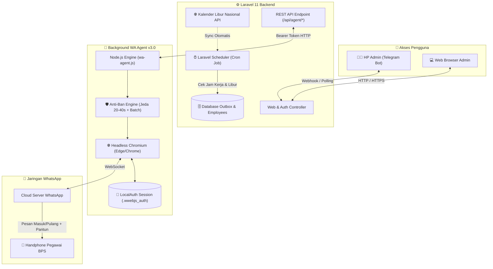

<p align="center">
  
</p>

<h1 align="center">⏰ BPS Smart Attendance Reminder v3.0</h1>

<p align="center">
  <b>Sistem Otomasi Pengingat Absensi Pegawai Terintegrasi WhatsApp Web & Telegram Remote Control</b>
</p>

<p align="center">
  <a href="https://laravel.com"></a>
  <a href="https://nodejs.org"></a>
  <a href="https://wwebjs.dev"></a>
  <a href="https://core.telegram.org/bots"></a>
  <a href="https://tailwindcss.com"></a>
  
  
</p>

<p align="center">
  <a href="#-fitur-unggulan">Fitur Utama</a> •
  <a href="#-arsitektur-sistem">Arsitektur</a> •
  <a href="#-cara-menjalankan-1-klik">Cara Menjalankan</a> •
  <a href="#-instalasi-cepat">Instalasi</a> •
  <a href="#-buku-panduan-lengkap">Dokumentasi</a> •
  <a href="#-tech-stack">Tech Stack</a>
</p>

---

## 🌟 Mengapa Sistem Ini Berbeda?

Aplikasi pengingat absensi konvensional sering kali memerlukan aplikasi pihak ketiga berbayar (API Gateway mahal) atau menggunakan automasi desktop yang mengganggu layar kerja komputer kantor.

**BPS Smart Attendance Reminder v3.0** hadir dengan revolusi:
- 🚫 **Tanpa Biaya Langganan Gateway**: Menggunakan engine WhatsApp Web Headless mandiri.
- 🚫 **Tanpa Mengganggu Layar Komputer**: 100% berjalan di background tanpa jendela terbuka (*headless Chromium*).
- 🛡️ **Anti-Ban Intelligent Jitter**: Menghindari pemblokiran nomor dengan mensimulasikan jeda alami manusia (20–40 detik acak) dan istirahat berkala (*batch cooldown*).
- 📱 **Kendali Penuh dari HP**: Admin dapat memicu pengiriman absensi atau memantau status secara jarak jauh melalui **Bot Telegram Admin**.

---

## ✨ Fitur Unggulan

### 🤖 1. WhatsApp Web Background Agent v3.0
- Berjalan sepenuhnya di latar belakang (*background service*).
- Otomatis mendeteksi browser bawaan sistem (**Microsoft Edge** maupun **Google Chrome**).
- **Persistent Session**: Scan QR cukup 1x saat pertama kali pasang, sesi tersimpan permanen.
- **Auto Reconnect & Graceful Shutdown**: Otomatis tersambung kembali saat koneksi internet pulih.

### 🛡️ 2. Perlindungan Anti-Ban Mutakhir
- **Human-Like Jitter Delay**: Jeda acak 20 hingga 40 detik antar pengiriman pesan.
- **Batch Cooldown Period**: Istirahat otomatis 1–2 menit setiap mengirim 3 pesan beruntun.
- **Validasi Nomor Cerdas**: Otomatis mendeteksi nomor yang tidak terdaftar di WhatsApp dan menandai gagal tanpa menghentikan antrean.

### 📱 3. Bot Telegram Admin (Remote Trigger)
- **Tombol Cepat**: `🌅 Kirim Masuk`, `🌇 Kirim Pulang`, `📊 Cek Status`.
- **Alert Notifikasi Otomatis**: Bot langsung mengirim pesan ke HP Admin jika koneksi WhatsApp terputus atau terjadi kegagalan.
- **Laporan Rekap Realtime**: Menerima laporan selesai kirim beserta rekap jumlah pesan sukses/gagal.

### 🎭 4. Generator Pantun Acak & Ramah
- Setiap pegawai mendapatkan variasi pantun unik yang berbeda setiap harinya.
- Mengubah pengingat absensi formal menjadi pesan sapaan yang hangat dan menyenangkan.

### 📅 5. Sinkronisasi Hari Libur Nasional & Jam Kerja Dinamis
- Otomatis terhubung dengan API resmi Hari Libur Nasional & Cuti Bersama Indonesia.
- Sistem **otomatis libur (skip kirim)** saat tanggal merah tanpa perlu setting manual.
- Dukungan jam kerja khusus (Senin–Kamis, Jumat, dan jam khusus Bulan Ramadhan).

### 📊 6. Web Dashboard Manajemen Modern
- Dibangun dengan **Laravel 11**, **Tailwind CSS v4**, dan **SweetAlert2**.
- Manajemen pegawai lengkap dengan fitur **Import / Export CSV**.
- **Live Outbox Monitor**: Memantau pesan yang sedang antre, diproses, maupun riwayat terkirim secara realtime.

---

## 🏛️ Arsitektur Sistem



---

## ⚡ Cara Menjalankan (1-Klik)

Untuk kemudahan penggunaan di komputer kantor, telah disediakan **Launcher Terpadu**:

### Cukup Double-Click: 👉 **`START.bat`**

Akan muncul menu interaktif di terminal:

```text
======================================================
   PENGINGAT ABSENSI BPS - LAUNCHER UTAMA
======================================================

  [1] Jalankan Semua Layanan Lokal (Standar)
      (Laravel + WA Agent + Bot Telegram + Scheduler)

  [2] Jalankan Semua + Online Publik (Cloudflare Tunnel)
      (Dapat diakses langsung dari HP luar kantor via HTTPS)

  [3] Jalankan Hanya WA Agent (Background Mode)

  [4] Jalankan Hanya Bot Telegram Admin

  [5] Buka Dashboard Admin di Web Browser

  [0] Keluar
======================================================
```

> **Tips:** Jika ingin langsung menjalankan semua layanan tanpa membuka menu, Anda juga bisa langsung mengklik file **`START-ALL.bat`**.

---

## 🚀 Instalasi Cepat (3 Langkah)

### 1. Clone Repositori & Persiapan Environment
```powershell
git clone https://github.com/faizarfi/pengingat-absen.git
cd pengingat-absen
copy .env.example .env
```

### 2. Instalasi Dependensi
```powershell
# Dependensi PHP & Laravel
composer install
php artisan key:generate

# Dependensi Frontend
npm install
npm run build

# Dependensi WA Agent
cd wa-desktop-agent
npm install
cd ..

# Migrasi Database & Seeder Awal
php artisan migrate --seed
php artisan holidays:sync
```

### 3. Tautkan Akun WhatsApp (Cukup 1x)
```powershell
.\START.bat
# Pilih menu [3] untuk menjalankan WA Agent
```
- Scan **QR Code** yang muncul di terminal melalui menu **Perangkat Tertaut (Linked Devices)** pada aplikasi WhatsApp di HP Anda.
- Selesai! Sesi login Anda tersimpan aman dan tidak perlu scan lagi saat komputer dinyalakan kembali.

---

## 📚 Buku Panduan Lengkap

Dokumentasi detail dan petunjuk operasional telah disusun di folder **`docs/`**:

| Dokumen | Deskripsi | Link |
| :--- | :--- | :--- |
| 💻 **Panduan PC Lain** | Panduan setup dari nol di PC / Laptop baru tanpa ribet. | [Baca Panduan](docs/PANDUAN_INSTALL_DI_PC_LAIN.md) |
| ☁️ **Panduan Hosting VPS** | Arsitektur Hybrid (Anti-Ban) di server VPS Linux Ubuntu, Nginx, SSL, dan PM2. | [Baca Panduan](docs/PANDUAN_HOSTING_VPS_DAN_AGENT.md) |
| 📊 **Template CSV Pegawai** | Format file CSV standar untuk import data pegawai secara massal. | [Unduh Template](docs/contoh-import-pegawai.csv) |

---

## 💻 Tech Stack

| Layer | Teknologi | Kegunaan |
| :--- | :--- | :--- |
| **Backend Framework** | **Laravel 11 (PHP 8.2+)** | Core system, REST API, scheduler, queue, & auth |
| **Automation Engine** | **Node.js + whatsapp-web.js** | Headless browser WhatsApp automation engine |
| **Process Runner** | **Puppeteer Core** | Pengendali browser Chromium / Edge di background |
| **Frontend & UI** | **Blade + Tailwind CSS v4** | Tampilan web dashboard responsif & modern |
| **Interactive Alert** | **SweetAlert2** | Dialog konfirmasi & notifikasi interaktif |
| **Database** | **MySQL / SQLite** | Penyimpanan data pegawai, jadwal, pantun & antrean |
| **Tunneling** | **Cloudflare Tunnel** | Akses publik aman via HTTPS tanpa perlu IP Publik |
| **Process Manager** | **PM2 Ecosystem** | Auto-restart & monitoring pada lingkungan produksi |

---

## 🖥️ Akses Dashboard Default

- **URL Lokal**: `http://localhost:8000/admin`
- **Email Default**: `admin@example.com`
- **Password Default**: `password`

*(Disarankan untuk segera mengganti password default melalui menu pengaturan akun setelah login pertama kali).*

---

## 📄 Lisensi & Kontribusi

Proyek ini dikembangkan di bawah lisensi **[MIT](LICENSE)**. Terbuka untuk pengembangan dan kustomisasi sesuai dengan kebutuhan satuan kerja dan instansi Anda.

<p align="center">
  Dibuat dengan ❤️ untuk kemudahan dan efisiensi operasional BPS.
</p>
